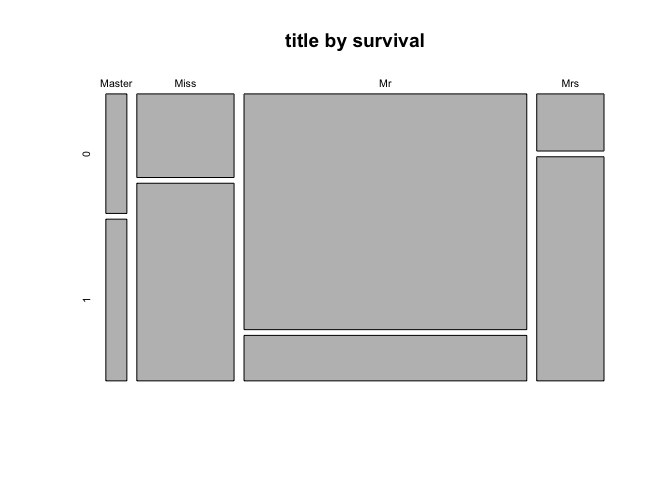
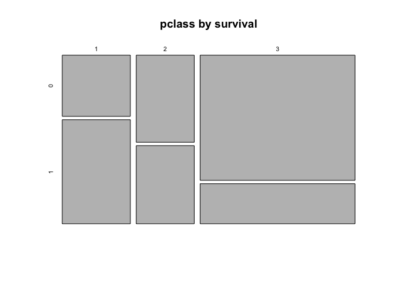
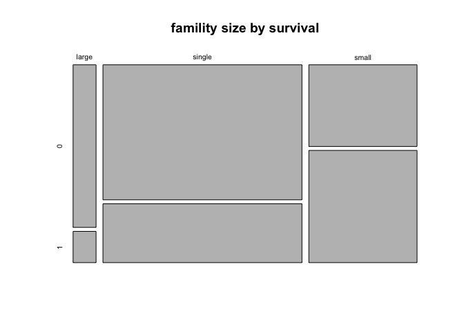
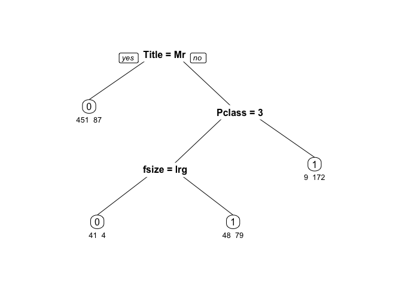

Machine Learning from Disaster: Titanic
================
Oleksandr Fialko
2016-09-25

This is my short summary of my investigation of the Titanic data set. It consists of three parts:

-   Data loading and preprocessing
-   Feature engineering
-   Machine learning with Decision Tree

### 1 Manipulating Data

First, lets load data

``` r
train <- read.csv("files/train.csv", header = TRUE,stringsAsFactors = FALSE)
test <- read.csv("files/test.csv", header = TRUE,stringsAsFactors = FALSE)
```

We combine the two data sets, `train` and `test`, into one data set `data_full`. `dplyr` library provides handy command `bind_rows`:

``` r
data_full <- bind_rows(train,test)
```

Let's check our data

``` r
str(data_full)
```

    ## 'data.frame':    1309 obs. of  12 variables:
    ##  $ PassengerId: int  1 2 3 4 5 6 7 8 9 10 ...
    ##  $ Survived   : int  0 1 1 1 0 0 0 0 1 1 ...
    ##  $ Pclass     : int  3 1 3 1 3 3 1 3 3 2 ...
    ##  $ Name       : chr  "Braund, Mr. Owen Harris" "Cumings, Mrs. John Bradley (Florence Briggs Thayer)" "Heikkinen, Miss. Laina" "Futrelle, Mrs. Jacques Heath (Lily May Peel)" ...
    ##  $ Sex        : chr  "male" "female" "female" "female" ...
    ##  $ Age        : num  22 38 26 35 35 NA 54 2 27 14 ...
    ##  $ SibSp      : int  1 1 0 1 0 0 0 3 0 1 ...
    ##  $ Parch      : int  0 0 0 0 0 0 0 1 2 0 ...
    ##  $ Ticket     : chr  "A/5 21171" "PC 17599" "STON/O2. 3101282" "113803" ...
    ##  $ Fare       : num  7.25 71.28 7.92 53.1 8.05 ...
    ##  $ Cabin      : chr  "" "C85" "" "C123" ...
    ##  $ Embarked   : chr  "S" "C" "S" "S" ...

`survived` and `pclass` features have 2 and 3 distinct values respectively. They better be converted into factors

``` r
data_full$Survived <- as.factor(data_full$Survived)
data_full$Pclass <- as.factor(data_full$Pclass)
```

`pclass` is an important feature. Rich passengers traveled in higher `pclass` survived as higher rate as can be seen from the following plot

``` r
p<-ggplot(data_full[1:891,], aes(x = Pclass, fill = Survived)) +
  geom_bar(stat = 'count',position='dodge') +
  xlab("Pclass") +
  ylab("Count") +
  labs(fill = "Survived")+theme_light()
ggplotly(p)
```

<!--html_preserve-->

<script type="application/json" data-for="htmlwidget-06131e0406dee10e2e7f">{"x":{"data":[{"x":[0.775,1.775,2.775],"y":[80,97,372],"text":["Pclass: 1<br>Survived: 0<br>count: 80","Pclass: 2<br>Survived: 0<br>count: 97","Pclass: 3<br>Survived: 0<br>count: 372"],"key":null,"type":"bar","marker":{"autocolorscale":false,"color":"rgba(248,118,109,1)","line":{"width":1.88976377952756,"color":"transparent"}},"name":"0","legendgroup":"0","showlegend":true,"xaxis":"x","yaxis":"y","hoverinfo":"text"},{"x":[1.225,2.225,3.225],"y":[136,87,119],"text":["Pclass: 1<br>Survived: 1<br>count: 136","Pclass: 2<br>Survived: 1<br>count: 87","Pclass: 3<br>Survived: 1<br>count: 119"],"key":null,"type":"bar","marker":{"autocolorscale":false,"color":"rgba(0,191,196,1)","line":{"width":1.88976377952756,"color":"transparent"}},"name":"1","legendgroup":"1","showlegend":true,"xaxis":"x","yaxis":"y","hoverinfo":"text"}],"layout":{"margin":{"b":43.8356164383562,"l":47.0236612702366,"t":27.1581569115816,"r":7.97011207970112},"plot_bgcolor":"rgba(255,255,255,1)","paper_bgcolor":"rgba(255,255,255,1)","font":{"color":"rgba(0,0,0,1)","family":"","size":15.9402241594022},"xaxis":{"type":"linear","autorange":false,"tickmode":"array","range":[0.4,3.6],"ticktext":["1","2","3"],"tickvals":[1,2,3],"ticks":"outside","tickcolor":"rgba(179,179,179,1)","ticklen":3.98505603985056,"tickwidth":0.33208800332088,"showticklabels":true,"tickfont":{"color":"rgba(77,77,77,1)","family":"","size":12.7521793275218},"tickangle":-0,"showline":false,"linecolor":null,"linewidth":0,"showgrid":true,"domain":[0,1],"gridcolor":"rgba(217,217,217,1)","gridwidth":0.33208800332088,"zeroline":false,"anchor":"y","title":"Pclass","titlefont":{"color":"rgba(0,0,0,1)","family":"","size":15.9402241594022},"hoverformat":".2f"},"yaxis":{"type":"linear","autorange":false,"tickmode":"array","range":[-18.6,390.6],"ticktext":["0","100","200","300"],"tickvals":[0,100,200,300],"ticks":"outside","tickcolor":"rgba(179,179,179,1)","ticklen":3.98505603985056,"tickwidth":0.33208800332088,"showticklabels":true,"tickfont":{"color":"rgba(77,77,77,1)","family":"","size":12.7521793275218},"tickangle":-0,"showline":false,"linecolor":null,"linewidth":0,"showgrid":true,"domain":[0,1],"gridcolor":"rgba(217,217,217,1)","gridwidth":0.33208800332088,"zeroline":false,"anchor":"x","title":"Count","titlefont":{"color":"rgba(0,0,0,1)","family":"","size":15.9402241594022},"hoverformat":".2f"},"shapes":[{"type":"rect","fillcolor":"transparent","line":{"color":"rgba(179,179,179,1)","width":0.66417600664176,"linetype":"solid"},"yref":"paper","xref":"paper","x0":0,"x1":1,"y0":0,"y1":1}],"showlegend":true,"legend":{"bgcolor":"rgba(255,255,255,1)","bordercolor":"transparent","borderwidth":1.88976377952756,"font":{"color":"rgba(0,0,0,1)","family":"","size":12.7521793275218},"y":0.905511811023622},"annotations":[{"text":"Survived","x":1.02,"y":1,"showarrow":false,"ax":0,"ay":0,"font":{"color":"rgba(0,0,0,1)","family":"","size":15.9402241594022},"xref":"paper","yref":"paper","textangle":-0,"xanchor":"left","yanchor":"top"}],"barmode":"stack","bargap":0,"hovermode":"closest"},"source":"A","config":{"modeBarButtonsToRemove":["sendDataToCloud"]},"base_url":"https://plot.ly"},"evals":[],"jsHooks":[]}</script>
<!--/html_preserve-->
### 2 Feature engineering

One powerful desired feature is `title`. It can be extracted from existing feature `name`. Each name in the full data set has a title in it. For example, the first passenger `Owen Haris` was titled as 'Mr.':

``` r
data_full$Name[1]
```

    ## [1] "Braund, Mr. Owen Harris"

So, let's extract titles from `name` using regular expressions:

``` r
data_full$Title <- gsub('(.*, )|(\\..*)','',data_full$Name)
table(data_full$Sex,data_full$Title)
```

    ##         
    ##          Capt Col Don Dona  Dr Jonkheer Lady Major Master Miss Mlle Mme
    ##   female    0   0   0    1   1        0    1     0      0  260    2   1
    ##   male      1   4   1    0   7        1    0     2     61    0    0   0
    ##         
    ##           Mr Mrs  Ms Rev Sir the Countess
    ##   female   0 197   2   0   0            1
    ##   male   757   0   0   8   1            0

Too many titles. Let's group them

``` r
data_full[data_full$Title %in% c("Dona", "the Countess"),'Title'] <- "Lady"
data_full[data_full$Title %in% c("Ms", "Mlle"),'Title'] <- "Miss"
data_full[data_full$Title == "Mme",'title'] <- "Mrs"
data_full[data_full$Title %in% c("Jonkheer", "Don"),'Title'] <- "Sir"
data_full[data_full$Title %in% c("Col", "Capt", "Major"),'Title'] <- "Officer"

data_full[data_full$Title == "Lady",'Title'] <- "Mrs"
data_full[data_full$Title %in% c("Rev", "Sir", "Officer"),'Title'] <- "Mr"
```

The title `Dr` is a bit tricky. There is one female with this title. Let's fix this:

``` r
table(data_full$Sex,data_full$Title)
```

    ##         
    ##           Dr Master Miss Mme  Mr Mrs
    ##   female   1      0  264   1   0 200
    ##   male     7     61    0   0 775   0

``` r
data_full[data_full$Sex=='female' & data_full$Title=='Dr','title']<-'Mrs'
data_full[data_full$Title=='Dr','Title'] <- 'Mr'
table(data_full$Sex,data_full$Title)
```

    ##         
    ##          Master Miss Mme  Mr Mrs
    ##   female      0  264   1   1 200
    ##   male       61    0   0 782   0

``` r
data_full$Title <- as.factor(data_full$Title)
```

``` r
p<-ggplot(data_full[1:891,], aes(x = Title, fill = Survived)) +
  geom_bar(stat='count') + facet_grid(.~Pclass)+
  xlab("Title") +
  ylab("Count") +
  labs(fill = "Survived")+theme_light()
ggplotly(p)
```

<!--html_preserve-->

<script type="application/json" data-for="htmlwidget-ee2d50f11577b99b5af3">{"x":{"data":[{"x":[2,4,5],"y":[2,77,1],"text":["Title: Miss<br>Survived: 0<br>count: 2","Title: Mr<br>Survived: 0<br>count: 77","Title: Mrs<br>Survived: 0<br>count: 1"],"key":null,"type":"bar","marker":{"autocolorscale":false,"color":"rgba(248,118,109,1)","line":{"width":1.88976377952756,"color":"transparent"}},"name":"0","legendgroup":"0","showlegend":true,"xaxis":"x","yaxis":"y","hoverinfo":"text"},{"x":[1,2,3,4,5],"y":[3,46,1,43,43],"text":["Title: Master<br>Survived: 1<br>count: 3","Title: Miss<br>Survived: 1<br>count: 46","Title: Mme<br>Survived: 1<br>count: 1","Title: Mr<br>Survived: 1<br>count: 43","Title: Mrs<br>Survived: 1<br>count: 43"],"key":null,"type":"bar","marker":{"autocolorscale":false,"color":"rgba(0,191,196,1)","line":{"width":1.88976377952756,"color":"transparent"}},"name":"1","legendgroup":"1","showlegend":true,"xaxis":"x","yaxis":"y","hoverinfo":"text"},{"x":[2,4,5],"y":[2,91,4],"text":["Title: Miss<br>Survived: 0<br>count: 2","Title: Mr<br>Survived: 0<br>count: 91","Title: Mrs<br>Survived: 0<br>count: 4"],"key":null,"type":"bar","marker":{"autocolorscale":false,"color":"rgba(248,118,109,1)","line":{"width":1.88976377952756,"color":"transparent"}},"name":"0","legendgroup":"0","showlegend":false,"xaxis":"x2","yaxis":"y","hoverinfo":"text"},{"x":[1,2,4,5],"y":[9,33,8,37],"text":["Title: Master<br>Survived: 1<br>count: 9","Title: Miss<br>Survived: 1<br>count: 33","Title: Mr<br>Survived: 1<br>count: 8","Title: Mrs<br>Survived: 1<br>count: 37"],"key":null,"type":"bar","marker":{"autocolorscale":false,"color":"rgba(0,191,196,1)","line":{"width":1.88976377952756,"color":"transparent"}},"name":"1","legendgroup":"1","showlegend":false,"xaxis":"x2","yaxis":"y","hoverinfo":"text"},{"x":[1,2,4,5],"y":[17,51,283,21],"text":["Title: Master<br>Survived: 0<br>count: 17","Title: Miss<br>Survived: 0<br>count: 51","Title: Mr<br>Survived: 0<br>count: 283","Title: Mrs<br>Survived: 0<br>count: 21"],"key":null,"type":"bar","marker":{"autocolorscale":false,"color":"rgba(248,118,109,1)","line":{"width":1.88976377952756,"color":"transparent"}},"name":"0","legendgroup":"0","showlegend":false,"xaxis":"x3","yaxis":"y","hoverinfo":"text"},{"x":[1,2,4,5],"y":[11,51,36,21],"text":["Title: Master<br>Survived: 1<br>count: 11","Title: Miss<br>Survived: 1<br>count: 51","Title: Mr<br>Survived: 1<br>count: 36","Title: Mrs<br>Survived: 1<br>count: 21"],"key":null,"type":"bar","marker":{"autocolorscale":false,"color":"rgba(0,191,196,1)","line":{"width":1.88976377952756,"color":"transparent"}},"name":"1","legendgroup":"1","showlegend":false,"xaxis":"x3","yaxis":"y","hoverinfo":"text"}],"layout":{"margin":{"b":43.8356164383562,"l":47.0236612702366,"t":39.9103362391034,"r":20.7222914072229},"plot_bgcolor":"rgba(255,255,255,1)","paper_bgcolor":"rgba(255,255,255,1)","font":{"color":"rgba(0,0,0,1)","family":"","size":15.9402241594022},"xaxis":{"type":"linear","autorange":false,"tickmode":"array","range":[0.4,5.6],"ticktext":["Master","Miss","Mme","Mr","Mrs"],"tickvals":[1,2,3,4,5],"ticks":"outside","tickcolor":"rgba(179,179,179,1)","ticklen":3.98505603985056,"tickwidth":0.33208800332088,"showticklabels":true,"tickfont":{"color":"rgba(77,77,77,1)","family":"","size":12.7521793275218},"tickangle":-0,"showline":false,"linecolor":null,"linewidth":0,"showgrid":true,"domain":[0,0.321473047500445],"gridcolor":"rgba(217,217,217,1)","gridwidth":0.33208800332088,"zeroline":false,"anchor":"y","title":"","titlefont":{"color":"rgba(0,0,0,1)","family":"","size":15.9402241594022},"hoverformat":".2f"},"annotations":[{"text":"Title","x":0.5,"y":-0.0900788709007887,"showarrow":false,"ax":0,"ay":0,"font":{"color":"rgba(0,0,0,1)","family":"","size":15.9402241594022},"xref":"paper","yref":"paper","textangle":-0,"xanchor":"center","yanchor":"middle","annotationType":"axis"},{"text":"Count","x":-0.0809464508094645,"y":0.5,"showarrow":false,"ax":0,"ay":0,"font":{"color":"rgba(0,0,0,1)","family":"","size":15.9402241594022},"xref":"paper","yref":"paper","textangle":-90,"xanchor":"center","yanchor":"middle","annotationType":"axis"},{"text":"1","x":0.160736523750222,"y":1,"showarrow":false,"ax":0,"ay":0,"font":{"color":"rgba(255,255,255,1)","family":"","size":12.7521793275218},"xref":"paper","yref":"paper","textangle":-0,"xanchor":"center","yanchor":"bottom"},{"text":"2","x":0.5,"y":1,"showarrow":false,"ax":0,"ay":0,"font":{"color":"rgba(255,255,255,1)","family":"","size":12.7521793275218},"xref":"paper","yref":"paper","textangle":-0,"xanchor":"center","yanchor":"bottom"},{"text":"3","x":0.839263476249778,"y":1,"showarrow":false,"ax":0,"ay":0,"font":{"color":"rgba(255,255,255,1)","family":"","size":12.7521793275218},"xref":"paper","yref":"paper","textangle":-0,"xanchor":"center","yanchor":"bottom"},{"text":"Survived","x":1.02,"y":1,"showarrow":false,"ax":0,"ay":0,"font":{"color":"rgba(0,0,0,1)","family":"","size":15.9402241594022},"xref":"paper","yref":"paper","textangle":-0,"xanchor":"left","yanchor":"top"}],"yaxis":{"type":"linear","autorange":false,"tickmode":"array","range":[-15.95,334.95],"ticktext":["0","100","200","300"],"tickvals":[0,100,200,300],"ticks":"outside","tickcolor":"rgba(179,179,179,1)","ticklen":3.98505603985056,"tickwidth":0.33208800332088,"showticklabels":true,"tickfont":{"color":"rgba(77,77,77,1)","family":"","size":12.7521793275218},"tickangle":-0,"showline":false,"linecolor":null,"linewidth":0,"showgrid":true,"domain":[0,1],"gridcolor":"rgba(217,217,217,1)","gridwidth":0.33208800332088,"zeroline":false,"anchor":"x","title":"","titlefont":{"color":"rgba(0,0,0,1)","family":"","size":15.9402241594022},"hoverformat":".2f"},"shapes":[{"type":"rect","fillcolor":"transparent","line":{"color":"rgba(179,179,179,1)","width":0.66417600664176,"linetype":"solid"},"yref":"paper","xref":"paper","x0":0,"x1":0.321473047500445,"y0":0,"y1":1},{"type":"rect","fillcolor":"rgba(179,179,179,1)","line":{"color":"transparent","width":0.66417600664176,"linetype":"solid"},"yref":"paper","xref":"paper","x0":0,"x1":0.321473047500445,"y0":1,"y1":1.0755905511811},{"type":"rect","fillcolor":"transparent","line":{"color":"rgba(179,179,179,1)","width":0.66417600664176,"linetype":"solid"},"yref":"paper","xref":"paper","x0":0.345193619166222,"x1":0.654806380833778,"y0":0,"y1":1},{"type":"rect","fillcolor":"rgba(179,179,179,1)","line":{"color":"transparent","width":0.66417600664176,"linetype":"solid"},"yref":"paper","xref":"paper","x0":0.345193619166222,"x1":0.654806380833778,"y0":1,"y1":1.0755905511811},{"type":"rect","fillcolor":"transparent","line":{"color":"rgba(179,179,179,1)","width":0.66417600664176,"linetype":"solid"},"yref":"paper","xref":"paper","x0":0.678526952499555,"x1":1,"y0":0,"y1":1},{"type":"rect","fillcolor":"rgba(179,179,179,1)","line":{"color":"transparent","width":0.66417600664176,"linetype":"solid"},"yref":"paper","xref":"paper","x0":0.678526952499555,"x1":1,"y0":1,"y1":1.0755905511811}],"xaxis2":{"type":"linear","autorange":false,"tickmode":"array","range":[0.4,5.6],"ticktext":["Master","Miss","Mme","Mr","Mrs"],"tickvals":[1,2,3,4,5],"ticks":"outside","tickcolor":"rgba(179,179,179,1)","ticklen":3.98505603985056,"tickwidth":0.33208800332088,"showticklabels":true,"tickfont":{"color":"rgba(77,77,77,1)","family":"","size":12.7521793275218},"tickangle":-0,"showline":false,"linecolor":null,"linewidth":0,"showgrid":true,"domain":[0.345193619166222,0.654806380833778],"gridcolor":"rgba(217,217,217,1)","gridwidth":0.33208800332088,"zeroline":false,"anchor":"y","title":"","titlefont":{"color":"rgba(0,0,0,1)","family":"","size":15.9402241594022},"hoverformat":".2f"},"xaxis3":{"type":"linear","autorange":false,"tickmode":"array","range":[0.4,5.6],"ticktext":["Master","Miss","Mme","Mr","Mrs"],"tickvals":[1,2,3,4,5],"ticks":"outside","tickcolor":"rgba(179,179,179,1)","ticklen":3.98505603985056,"tickwidth":0.33208800332088,"showticklabels":true,"tickfont":{"color":"rgba(77,77,77,1)","family":"","size":12.7521793275218},"tickangle":-0,"showline":false,"linecolor":null,"linewidth":0,"showgrid":true,"domain":[0.678526952499555,1],"gridcolor":"rgba(217,217,217,1)","gridwidth":0.33208800332088,"zeroline":false,"anchor":"y","title":"","titlefont":{"color":"rgba(0,0,0,1)","family":"","size":15.9402241594022},"hoverformat":".2f"},"showlegend":true,"legend":{"bgcolor":"rgba(255,255,255,1)","bordercolor":"transparent","borderwidth":1.88976377952756,"font":{"color":"rgba(0,0,0,1)","family":"","size":12.7521793275218},"y":0.905511811023622},"barmode":"stack","hovermode":"closest"},"source":"A","config":{"modeBarButtonsToRemove":["sendDataToCloud"]},"base_url":"https://plot.ly"},"evals":[],"jsHooks":[]}</script>
<!--/html_preserve-->
``` r
mosaicplot(table(data_full$Title,data_full$Survived),main='title by survival')
```



``` r
mosaicplot(table(data_full$Pclass,data_full$Survived),main='pclass by survival')
```



Main conclusions so far:

-   people with the title 'Mr' had high probability to perish.
-   people from the 3d class had high probability to perish.

One more feature which appeared to be useful is `family size`. It can be extracted by adding `sibsp` + `parch` + 1. We further bin the family size into 3 categories:

``` r
data_full$familysize <- data_full$SibSp + data_full$Parch + 1

data_full$fsize[data_full$familysize==1] <- 'single'
data_full$fsize[data_full$familysize <= 4 & data_full$familysize > 1] <- 'small'
data_full$fsize[data_full$familysize >= 5] <- 'large'
data_full$fsize <- as.factor(data_full$fsize)
mosaicplot(table(data_full$fsize,data_full$Survived),main='famility size by survival')
```



There is a survival penalty for traveling with a large family.

### 3 Decision Tree

Random Forests are more powerful than single trees, but single trees have the advantage of being easier to understand.

``` r
X <- data_full[1:891,c('Pclass','fsize','Title')]
y <- as.factor(data_full[1:891,'Survived'])

folds <- createMultiFolds(y, k = 3, times = 10)
ctrl  <- trainControl(method = "repeatedcv", number = 3, repeats = 10,
                       index = folds)

rpart.cv <- train(x = X, y = y, method = "rpart", tuneLength = 10, 
                    trControl = ctrl)


prp(rpart.cv$finalModel,type = 0, extra = 1, under = TRUE) # display the results 
```


